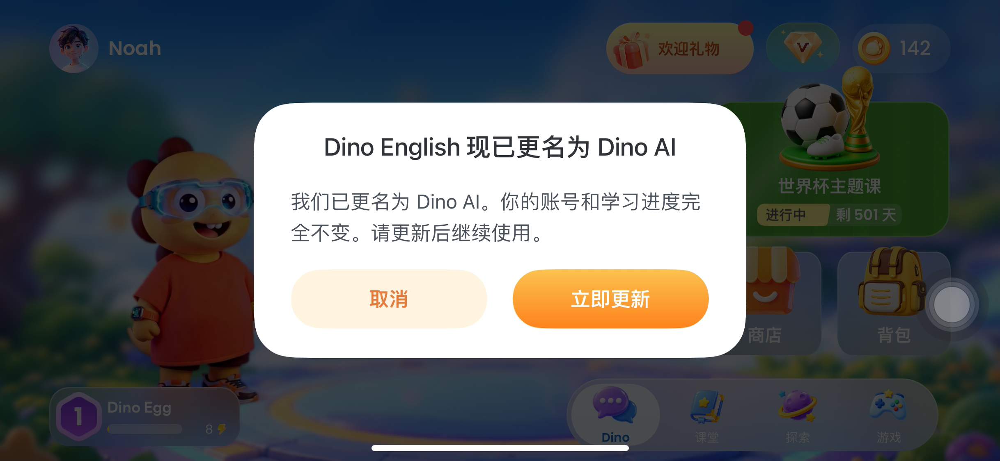

# 给开发

每条都尽量回答：类型、打开哪、建议动作。

## 行为回归失败

### `home-chat-hub`

- 类型：产品或用例契约
- 断言/错误：`{'type': 'assertion', 'message': "Element not visible: text='课堂' (cause: context deadline exceeded: no elements match selector)"}`
- 建议：对照 flow `/Users/dino/ios-quality/flows-real/home/home-chat-hub.yaml` 与截图，确认是页面改了还是产品 bug。

### `home-chat-hub`

- 类型：产品或用例契约
- 断言/错误：`{'type': 'network', 'message': 'Failed to create session for app: com.prime.dino.english (cause: failed to create session: Post "http://localhost:8266/session": read tcp [::1]:59873->[::1]:8266: read: connection reset by peer)'}`
- 建议：对照 flow `/Users/dino/ios-quality/flows-real/home/home-chat-hub.yaml` 与截图，确认是页面改了还是产品 bug。

## 跑批本身（质量机）

- 性能体检·页面[play]：exit 1

上质量机看 `/Users/dino/ios-quality/reports/quality-run/20260818-200957/run.log`。

## 健康度数字

见卡片「本次 vs 上次」。原始 JSON 在 `perf/*.metrics.json`。

